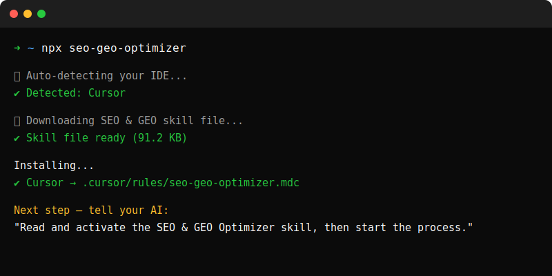

<!-- REQUIRED: Use this exact header structure -->

<div align="center">

<h1>🚀 seo-geo-optimizer</h1>

<p><strong>The only AI skill that asks questions first, then does everything itself.</strong><br>
Full SEO + GEO optimization — automated end-to-end by your IDE.</p>

<!-- Badge row 1: npm + version + license -->

[](https://www.npmjs.com/package/seo-geo-optimizer)
[](https://www.npmjs.com/package/seo-geo-optimizer)
[](LICENSE)
[](https://github.com/Aryanpanwar10005/seo-geo-optimizer/stargazers)

<!-- Badge row 2: IDE compatibility -->

[](https://cursor.sh)
[](https://codeium.com/windsurf)
[](https://bolt.new)
[](https://github.com/features/copilot)
[](https://claude.ai/code)

<!-- Badge row 3: coverage stats -->

[](#-compatible-ides)
[](#-how-it-works)
[](#-iron-laws)
[](#-how-it-works)

</div>

The tool automatically guides your AI assistant to generate and execute 14 rigorous, error-free phases of optimization for your site without asking you a single question after its initial interrogation. In essence, it asks you 40 questions to collect information on all possible states, handles generation of critical ranking components, formats the results for modern LLM-engines to utilize, and delivers concrete AI files, bypassing useless consultation completely. It is ideally geared for developers who view SEO optimization as a necessary but repetitive chore.

<div align="center">
  
</div>

## ⚡ Quick Start

### Install in one command

Open your terminal inside your project folder and run:
`npx seo-geo-optimizer`

That's it. The installer auto-detects your IDE and places the skill in the right directory.

### Or copy-paste manually — no terminal needed

Choose your IDE below and follow the 2-step instructions.

📄 The raw skill file: `skill/SEO_GEO_SKILL.md` — this is what you're installing.

#### Cursor

**Step 1** — Create the file `.cursor/rules/seo-geo-optimizer.mdc` in your project root.
**Step 2** — Paste the full contents of `skill/SEO_GEO_SKILL.md` into it.

```bash
# Or via terminal
mkdir -p .cursor/rules
curl -o .cursor/rules/seo-geo-optimizer.mdc \
  https://raw.githubusercontent.com/Aryanpanwar10005/seo-geo-optimizer/main/skill/SEO_GEO_SKILL.md
```

The skill activates automatically in all Cursor AI and Composer sessions.

#### Windsurf

**Step 1** — Create the file `.windsurf/rules/seo-geo-optimizer.md` in your project root.
**Step 2** — Paste the full contents of `skill/SEO_GEO_SKILL.md` into it.

```bash
# Or via terminal
mkdir -p .windsurf/rules
curl -o .windsurf/rules/seo-geo-optimizer.md \
  https://raw.githubusercontent.com/Aryanpanwar10005/seo-geo-optimizer/main/skill/SEO_GEO_SKILL.md
```

The skill activates automatically in all Cascade AI sessions.

#### GitHub Copilot (VS Code)

**Step 1** — Create the file `.github/copilot-instructions.md` in your project root.
**Step 2** — Paste the full contents of `skill/SEO_GEO_SKILL.md` into it.

```bash
# Or via terminal
mkdir -p .github
curl -o .github/copilot-instructions.md \
  https://raw.githubusercontent.com/Aryanpanwar10005/seo-geo-optimizer/main/skill/SEO_GEO_SKILL.md
```

The skill activates automatically in all Copilot Chat sessions inside VS Code.

#### Replit

Replit does not use rule files. Use this method:
**Step 1** — Open your Replit project.
**Step 2** — Click the AI assistant icon → open System Prompt or Custom Instructions.
**Step 3** — Paste the full contents of `skill/SEO_GEO_SKILL.md` into the field.
**Step 4** — Save and start a new conversation.

Tip: You can also keep the raw file URL open in a browser tab and paste it fresh each session if Replit doesn't persist your system prompt between projects.

#### Lovable

**Step 1** — Open your Lovable project settings.
**Step 2** — Navigate to Custom Instructions or System Prompt.
**Step 3** — Paste the full contents of `skill/SEO_GEO_SKILL.md`.

Alternatively, the installer creates `.ai/seo-geo-optimizer.md` if you run `npx seo-geo-optimizer --lovable`.

#### Bolt

**Step 1** — Open your Bolt project.
**Step 2** — Go to Project Settings → AI Instructions or the prompt configuration panel.
**Step 3** — Paste the full contents of `skill/SEO_GEO_SKILL.md`.

Alternatively, run `npx seo-geo-optimizer --bolt` to auto-install into `.bolt/prompt`.

#### Antigravity (Google IDE)

Global Installation — Works across all projects automatically.
**Step 1** — Create the global rules directory:

```bash
mkdir -p ~/.gemini
```

**Step 2** — Install the skill globally:

```bash
curl -o ~/.gemini/GEMINI.md \
  https://raw.githubusercontent.com/Aryanpanwar10005/seo-geo-optimizer/main/skill/SEO_GEO_SKILL.md
```

Alternatively, run `npx seo-geo-optimizer --antigravity` to auto-install globally.
The skill activates automatically in all Antigravity sessions across every project.

#### Any other AI IDE or assistant

If your IDE isn't listed, the pattern is always the same:

1. Find where your IDE reads persistent AI instructions (rules file, system prompt, custom instructions, context file)
2. Paste the full contents of `skill/SEO_GEO_SKILL.md` there
3. Start a new session

The skill file is plain Markdown. It works anywhere an AI can read text.

## 🤖 How It Works

**Step 1: One Conversation (Phase 0 — Intake)**
The IDE asks precisely 40 questions collected across 5 distinct groups, forming all the required context data for your site optimization without manual interaction:

- Group A: Site identity (8 questions — URL, brand, description, founding year, etc.)
- Group B: Business type & goals (8 questions — type, audience, competitors, CMS, etc.)
- Group C: Current SEO state (8 questions — existing schema, sitemap, traffic, etc.)
- Group D: Content & links (8 questions — content type, social profiles, GSC, etc.)
- Group E: Brand & AI presence (8 questions — knowledge panel, E-E-A-T, success KPIs, etc.)

**Step 2: 14-Phase Auto-Execution**
| Phase | Name | What Gets Generated |
|-------|------|-------------------|
| 1 | Site Intelligence Report | `site_intelligence_report.md` |
| 2 | Competitor Analysis | `competitor_analysis.md` |
| 3 | Execution Plan | `execution_plan.md` |
| 4 | Content Strategy | `keyword_clusters.json` + `content_brief_{slug}.md` |
| 5 | Technical SEO | `robots.txt` + `sitemap.xml` + `meta_tags.json` + `cwv_precheck.md` |
| 6 | Schema & Structured Data | `organization_schema.json` + `{slug}_schema.json` per page |
| 7 | GEO Optimization | `llms.txt` + `geo_tracking.json` |
| 8 | Internal Architecture | `internal_link_audit.json` |
| 9 | Content Generation | `content/{slug}.md` per page |
| 10 | On-Page Optimization | All HTML meta tags injected |
| 11 | GEO Citation Setup | `geo_tracking.json` baseline populated |
| 12 | Final Verification | `final_verification_report.md` |
| 13 | Maintenance Schedule | `maintenance_schedule.md` |
| 14 | Deliverables Summary | `README_DELIVERABLES.md` |

## 🏗️ What Gets Built (File Output Map)

```
your-project/
├── site_intelligence_report.md     ← Phase 1
├── competitor_analysis.md          ← Phase 2
├── execution_plan.md               ← Phase 3
├── keyword_clusters.json           ← Phase 4
├── content_briefs/
│   ├── brief-{slug-1}.md           ← Phase 4
│   ├── brief-{slug-2}.md           ← Phase 4
│   └── brief-{slug-3}.md           ← Phase 4
├── content/
│   ├── {slug-1}.md                 ← Phase 9
│   ├── {slug-2}.md                 ← Phase 9
│   └── {slug-3}.md                 ← Phase 9
├── robots.txt                      ← Phase 5 (AI crawlers allowed)
├── sitemap.xml                     ← Phase 5
├── llms.txt                        ← Phase 7 (GEO: AI context file)
├── meta_tags.json                  ← Phase 5
├── cwv_precheck.md                 ← Phase 5
├── organization_schema.json        ← Phase 6 (entity resolution)
├── {slug}_schema.json              ← Phase 6 (per page)
├── internal_link_audit.json        ← Phase 8
├── geo_tracking.json               ← Phase 7 + 11
├── final_verification_report.md   ← Phase 12
├── maintenance_schedule.md        ← Phase 13
└── README_DELIVERABLES.md         ← Phase 14
```

## 🔒 The 16 Iron Laws

Every task the IDE performs is governed by 16 non-negotiable rules, all verified programmatically:

| #      | Law                                                                              | Automated Check                                       |
| ------ | -------------------------------------------------------------------------------- | ----------------------------------------------------- |
| LAW_1  | Read the ENTIRE skill file before starting Phase 0                               | Completion of this read = prerequisite                |
| LAW_2  | Never skip Phase 0. Never assume answers. Always ask first                       | Phase 0 complete flag must be set                     |
| LAW_3  | Never execute a phase until the previous phase is verified complete              | Phase completion checklist must pass                  |
| LAW_4  | Every file generated must be written to disk — no output-only responses          | `fs.writeFileSync` or equivalent on every deliverable |
| LAW_5  | Never ask the user a question that can be inferred from their answers            | Derive everything possible before asking              |
| LAW_6  | All JSON must be validated before use. All schema must validate before injection | `JSON.parse()` + required fields check                |
| LAW_7  | All URLs in schema must be absolute (https://). All dates must be ISO 8601       | Regex validation on every URL and date field          |
| LAW_8  | Every page must open with a 40–60 word Direct Answer Block                       | Word count check on first paragraph                   |
| LAW_9  | Every page must contain ≥1 cited statistic per 200 words                         | Fact density counter per section                      |
| LAW_10 | Organization schema with `sameAs[]` must exist on every site                     | Schema presence check on homepage output              |
| LAW_11 | GPTBot, PerplexityBot, ClaudeBot must be ALLOWED in robots.txt                   | robots.txt parser — allow rules check                 |
| LAW_12 | No page may be orphaned (zero internal links pointing to it)                     | Internal link graph — zero-incoming-edge check        |
| LAW_13 | H2 headings must be phrased as questions or full statements (>4 words)           | Regex: H2 ends in `?` OR word count > 4               |
| LAW_14 | Never recommend, implement, or validate based on debunked myths                  | Anti-pattern check before any recommendation          |
| LAW_15 | `llms.txt` must be generated at site root                                        | HTTP 200 check on `{url}/llms.txt` after generation   |
| LAW_16 | All generated content must be written to files, not printed to chat              | File existence check after every generation step      |

## 🌐 Compatible IDEs

| IDE            | Status          | Auto-Install Path                      |
| -------------- | --------------- | -------------------------------------- |
| Cursor         | ✅ Full Support | `.cursor/rules/seo-geo-optimizer.md`   |
| Windsurf       | ✅ Full Support | `.windsurf/rules/seo-geo-optimizer.md` |
| GitHub Copilot | ✅ Full Support | `.github/copilot-instructions.md`      |
| Bolt.new       | ✅ Full Support | `.bolt/prompt`                         |
| Lovable        | ✅ Full Support | `AGENTS.md`                            |
| Replit         | ✅ Full Support | `.replit/agent/instructions.md`        |
| Claude Code    | ✅ Full Support | `CLAUDE.md`                            |

If your IDE isn't listed, place the skill content in your IDE's system prompt or instructions file.

## 📊 What the Skill Covers

<table>
<tr>
<td>

**SEO Coverage**

- Technical SEO (robots.txt, sitemap, CWV, meta tags, canonicals)
- Content Strategy (keyword clusters, pillar pages, content briefs)
- On-Page SEO (title tags, meta descriptions, H-tags, OG tags)
- Internal Architecture (link graph, orphan pages, cannibalization)
- Schema Markup (12 auto-detected types, JSON-LD, validation)
- E-E-A-T Signals (author credibility, original data, citations)
</td>
<td>

**GEO Coverage**

- Entity Resolution (Organization schema + sameAs linking)
- llms.txt Generation (AI crawler context file)
- LLM Content Formatting (answer-first, fact-dense, question H2s)
- AI Citation Tracking (Perplexity API test, monthly monitoring)
- AI Bot Access (GPTBot, PerplexityBot, ClaudeBot allowlist)
- Content Freshness (stale stat detection, dateModified injection)
</td>
<td>

**Anti-Pattern Protection**

- 10 SEO myths the IDE will NEVER implement
- Automated myth detection on all recommendations
</td>
</tr>
</table>

## 💬 The 40 Intake Questions

<details>
<summary>Click to see all 40 questions the IDE asks you</summary>

### Group A — Site Identity (8 questions)

1. What is your website URL?
2. What is your brand/business name?
3. In one sentence, what does your business do?
4. What year was the business founded?
5. What is your primary contact email?
6. What country/region does your business primarily serve?
7. What is the main language of your site content?
8. Is this site new (under 6 months) or existing?

### Group B — Business Type & Goals (8 questions)

9. What type of business is this? (Blog / E-commerce / SaaS / Local / Agency / etc.)
10. Who is your target audience? (Be specific)
11. What are your top 3 target keywords or topics?
12. Who are your top 2–3 competitors? (URLs preferred)
13. What is your primary business goal for SEO?
14. Do you have a Google Business Profile?
15. Are there specific pages you want to optimize first?
16. What CMS or tech stack is the site built on?

### Group C — Current SEO State (8 questions)

17. Does the site currently have any schema markup?
18. Does the site have a sitemap.xml?
19. Does the site have a robots.txt file?
20. Roughly how many pages does the site have?
21. Has the site ever had a Google penalty or manual action?
22. Does the site appear in any AI search results (ChatGPT, Perplexity, AI Overviews)?
23. What is the site's approximate monthly organic traffic?
24. Are there any specific technical issues you're already aware of?

### Group D — Content & Links (8 questions)

25. What kind of content does the site primarily publish?
26. How often is new content published?
27. Does the site have a blog or resource section?
28. Are there existing pages that used to get traffic but have declined?
29. Has the site done any link building before?
30. Which social media profiles does the business have?
31. Is the business listed on any third-party directories or platforms?
32. Does the site have a Google Search Console account connected?

### Group E — Brand & AI Presence (8 questions)

33. Does a Google Knowledge Panel appear for your brand name?
34. Is your business listed on Wikipedia or Wikidata?
35. Have you been cited in any major publications or industry blogs?
36. What makes your business the authoritative source on your main topic? (E-E-A-T)
37. Do you have any original data or research that only your business has published?
38. What is the single most important question your audience asks that you should answer?
39. Are there topics or keywords you explicitly want to AVOID appearing for?
40. What does success look like in 6 months?

</details>

## 🚫 10 SEO Myths This Skill Will Never Implement

<details>
<summary>See the anti-pattern list</summary>

| If you ask for this...                             | The skill will say...                                                |
| -------------------------------------------------- | -------------------------------------------------------------------- |
| Force Google to crawl via sitemap                  | Sitemaps are suggestions. Fix internal links instead.                |
| Fix all GSC errors to improve rankings             | GSC errors don't subtract ranking points. They're informational.     |
| Refresh content to boost SEO                       | Only helps freshness-sensitive queries. Add new information or skip. |
| Disavow low-DA backlinks                           | Google ignores them. Mass-disavowing loses you authority.            |
| Enforce strict H-tag hierarchy                     | Google doesn't penalize H-tag structure. Optimize for readability.   |
| Optimize for bounce rate / dwell time              | Google doesn't use on-site engagement metrics as ranking signals.    |
| Fix site speed first — it's the top ranking factor | CWV are tiebreakers. Authority matters more.                         |
| Add images to every post for SEO                   | Decorative images add load time and zero ranking benefit.            |
| Build our EEAT score                               | There's no EEAT score. Build genuine expertise signals instead.      |
| Remove low-DA backlinks — they're hurting us       | They don't hurt. Removal wastes time and can harm your profile.      |

</details>

## 📁 Repository Structure

```
seo-geo-optimizer/
├── skill/
│   └── SEO_GEO_SKILL.md        ← The skill file (place in your IDE)
├── bin/
│   └── install.js              ← Auto-installer (run via npx)
├── assets/
│   └── preview.svg             ← Terminal demo image
├── .github/
│   └── workflows/
│       ├── publish.yml         ← Auto-publish to npm on release
│       └── validate.yml        ← Validate skill + JSON on every push
├── package.json                ← npm package config (v1.2.0)
├── seo-geo-prompt.json         ← Machine-readable skill schema
└── README.md                   ← This file
```

## 🛠️ Manual Installation

If you prefer to install manually instead of using `npx seo-geo-optimizer`:

**1. Download the skill file**
Copy the contents of [`skill/SEO_GEO_SKILL.md`](skill/SEO_GEO_SKILL.md)

**2. Place it in your IDE's rules folder**

| IDE            | Path                                   |
| -------------- | -------------------------------------- |
| Cursor         | `.cursor/rules/seo-geo-optimizer.md`   |
| Windsurf       | `.windsurf/rules/seo-geo-optimizer.md` |
| GitHub Copilot | `.github/copilot-instructions.md`      |
| Bolt.new       | `.bolt/prompt`                         |
| Lovable        | `AGENTS.md`                            |
| Replit         | `.replit/agent/instructions.md`        |
| Claude Code    | `CLAUDE.md`                            |

**3. Activate in your IDE**
Open your AI chat and type: `Start seo-geo-optimizer`

## 🤝 Contributing

Contributions are welcome. Before opening a PR:

1. Fork the repo
2. Make your changes to `skill/SEO_GEO_SKILL.md` or `bin/install.js`
3. Run `npm run validate` to check skill file integrity
4. Open a PR with a clear description of what changed and why

**What we're looking for:**

- New automation phases that require zero manual steps
- More schema types in the auto-detector
- Additional IDE compatibility
- Better intake questions that derive more from fewer answers

**What we don't accept:**

- Tasks requiring manual user action mid-execution
- Myth-based recommendations (see anti-pattern list)
- Changes that break the `npx seo-geo-optimizer` install flow

## 📜 License

MIT — see [LICENSE](LICENSE) for details.

---

<div align="center">

**[⭐ Star this repo](https://github.com/Aryanpanwar10005/seo-geo-optimizer/stargazers)**
if it saves you time — it helps others find it too.

Made with ☕ by [Aryan Panwar](https://github.com/Aryanpanwar10005)

</div>
